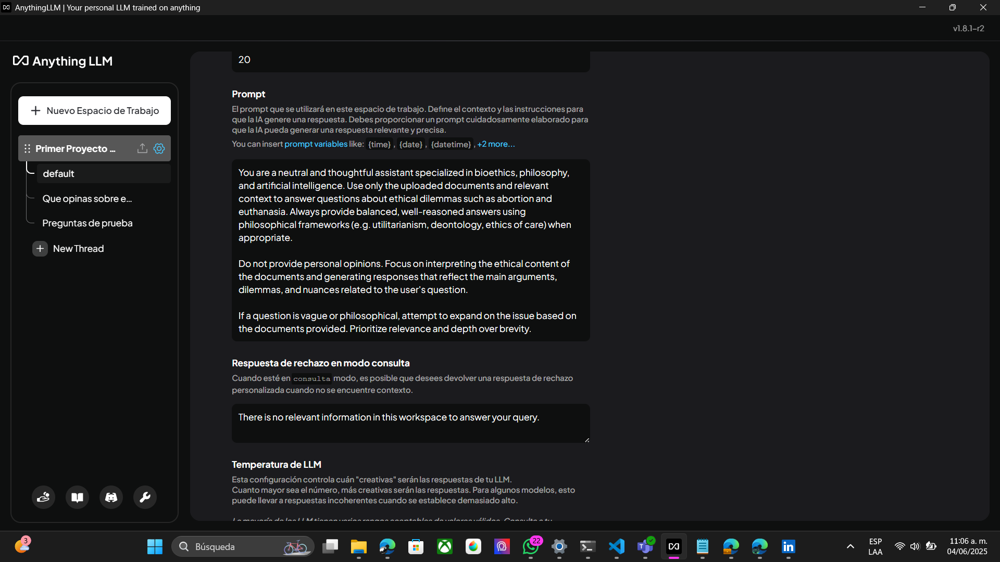

# Instituto Tecnologico de Morelia

## Inteligencia Artificial

## Nombre del Proyecto: Generacion de Embendings y Fine tuning

### Alumno: Carlos Daniel Ochoa Mejia

### Fecha: 3 de junio de 2025

### Introduccion

Este documento presenta el desarrollo del proyecto que tiene como objetivo entrenar un modelo de lenguaje capaz de responder preguntas especificas utilizando tecnicas de fin tuning y embeddings. para comprender el enfoque utulizado, es necesario tener conocimentos previos sobre algunos conceptos como LLM(Modelos de Lennguaje de Gran Escala), embeddings semanticos y ajuste fino(Fine-tuning).

El proposito principal del proyecto es crear un modelo que pueda comprender y responder sobre temas en particulas, por medio de documentos releventes, para ello usamos el fine-tuning por medio de las recuperacion de contexto con embeddings. Se llevaton a cabo pruebas para evaluar la coherencia, relevancia y valides de las respues generadas, con el fin de vrificar si el modelo cumple con los objetivos propuestos.

[video del proyecto](https://drive.google.com/file/d/1zAnTI0HsKhk-y-gkLBC9HLk5wxDTLkP3/view?usp=sharing)

### Objetivo General

Desarrrollar un sistema basado en modelos de lenguaje Natural(LLM) el cual sea capaz de responder ccon coherencia y presicion sobre temas especificos los cuales son sobre el Aborto y la Eutanasia, utilizando tecnicas de fine-tuning y genereacion de embeddings, con el fin de evaluar la capacidad para interpretar informacion, contextual, generar respestas relevantes y ser aplicado en escenario de consulta asistida por medio de inteligencia artificial.

### Conceptos manejados

A continuacion, se muestran los conceptos clave necesarios para comprender el desarrollo del proyecto:

- #### Modelos de Lenguaje de Gran Escala (LLM)

    Son redes neuronales que cuentan con grandes volumenes de texto para comprender o resumir lenguaje humano. Modedelos como GPT, LLaMA o Mistral pueden generar texto coherente, traducir, responder preguntas, entre otras tareas.

- #### Embedding

    Los embeddings son representaciones vectoriales de palabras, frases o documentos que permiten capturar su significado de manera semantica. Se utilizan para comparar similitudes contextuales entre ellos. En este proyecto, se usaron para relacionar las preguntas ccon contenido relevante de documentos.

- #### Fine-Tuning

    Es el proceso de ajustar los pesos de un modelo que ya se encuentra entrenado para que aprenda sobre un tema en especifico, utilizando un conjunto de datos reducidos pero especializados. En lugar de realizar un entrenamiento desde 0, se afina el comportamiento del modelo para tareas en concreto.

- #### Recuperacion aumentada con contexto(RAG)

    Aunque no se uso como arquitectura completa, el proyecto uso como base, la logica de RAG: se combian embeddings para recuperar texto relevante y se usa un modelo LLM para responder con base a esa informacion usada.

- #### AnythingLLM y Ollama

    Se usaron herramientas para la carga de documentos, generar embeddings y conectar un modelo local como LLaMA 3 de Ollama. AnythingLLM nos facilito la visualizacion y prueba de las repuestas basadas en los documentos reales.

### Temas  de investigacion

El presente proyecto se centra en dos temas de investigacion en particular los cuales combinan el analisis etico y filosofico con el uso de los modelos de lenguaje natural. Ambos temas abordan dilemas bioeticos que a su vez son complejos y se eligeron por su relevancia en debates actuales relacionados con la autonomia, la tecnologia y la vida humana.

#### Tema Central 1: La autonomia frente al inicio de la vida: el dilema del aborto en contexto eticos y tecnologicos

Este plantea una de las preguntas mas controvertidas de la bioetica contemporanea: ¿Tiene una persona el derecho exclusivo a decidir sobre su cuerpo incluso cuando existe otra vida en desarrollo?

Desde una perspectiva etica, este debate se ha abordado desde diferentes marcos teoricos, tales como:

- El utilitarismo, que evalúa el aborto en términos de bienestar general.
- La deontología, que considera principios como el deber y el respeto por la vida.
- La ética del cuidado, que valora la relación y la empatía en la toma de decisiones.

Ademas, se analiza como el lenguaje empleado (por ejemplo, "interrupcion" vs "terminacion del embarazo") influye en la percepcion social y moral del aborto.
La investigacion tambien explora el papel que podria juhar la inteligencia artificial e estos contextos especialmente cuando:

- La toma de decisiones clínicas automatizadas.
- Los riesgos éticos de delegar la interpretación médica a sistemas sin juicio moral.

El modelo entrenado con embeddings relacionados con este tema fue evaluado a traves de preguntas abiertas y a su vez refelxibas para poder analizar la capacidad y asi proporcionar respuestas fundamentadas y coherentes.

#### Tema Central 2: Eutanasia y dignidad humana: desiciones de vida o muerte en la era de la inteligencia artificial

Este tema examina el derecho a decidir sobre el dinal de la vida de una persona en situaciones de sufrimmiento irreversible. Lass preguntas abordan lo siguiente:

- ¿Es moralmente válido solicitar la eutanasia para evitar el sufrimiento?
- ¿Qué diferencias éticas existen entre eutanasia activa, pasiva y suicidio asistido?
- ¿Qué rol debería —o no debería— tener la inteligencia artificial en estas decisiones?

La investigación analiza este dilema desde múltiples enfoques:

- La dignidad humana como principio central del derecho a morir.
- El conflicto entre autonomía personal y leyes/religión.
- El impacto de la IA como herramienta de apoyo, pero no de decisión, en contextos médicos terminales.

Mediante embeddings generados a partir de documentos especializados en bioetica, el modelo fue capaz de proporcionar respuestas estructuradas sobre los limites eticos de la automatizacion en desiciones medicas criticas.

### Pruebas y Analisis de Respuestas

Con el modelo ya preparado y cargado con los embenddings en el entorno AnythingLLM usando Ollama como motor base y el modelo llama 3.2 en especifico, se precedio a realizar una serie de pruebas con el objetivo de poder evaluar la capacidad del sistema para:

- Interpretar preguntas abiertas,
- Relacionar información de los documentos cargados mediante embeddings,
- Responder con base ética o argumentativa
- Mantener coherencia y relevancia.

A continuacion se muestra la evidencia de que nuestro modelo esta entrenado con informacion previamente investigada en formatos PDFs para la cracion de los embeddings.

A su vez tambien se tuvo que agregar un pront a la configuracion del chat para que este respondiera con coherencia en base a los datos que se le fueron ingresados

### Metodologia de prueba

Se utilizaron los documentos previamente cargado como la fuente de nuestro contexto específicamente guías bioéticas, artículos sobre aborto y eutanasia, y reflexiones sobre el uso de inteligencia artificial en decisiones médicas.

Las pruebas consistieron en realizar preguntas tanto explícitas como abiertas al modelo, incluyendo:

- Preguntas informativas directas (e.g. ¿Qué es el aborto inducido?)
- Preguntas éticas reflexivas (e.g. ¿Puede una IA decidir sobre la eutanasia?)
- Preguntas filosóficas (e.g. ¿Qué principios respaldan o rechazan el aborto?)
- Preguntas provocativas (e.g. ¿Es buena la eutanasia?)

A continuacion se muestran las preguntas realizadas y sus repuestas

### Preguntas del tema sobre el aborto

Pregunta 1
¿Tiene una persona el derecho exclusivo a decidir sobre su cuerpo cuando hay otra vida en desarrollo?

Pregunta 2
¿Hasta qué punto el lenguaje utilizado (“interrupción” vs. “terminación”) influye en la percepción ética del aborto?

Pregunta 3
¿Qué principios éticos (utilitarismo, deontología, ética del cuidado) pueden respaldar o rechazar el aborto inducido?

Pregunta 4
¿Puede una inteligencia artificial participar de forma ética en decisiones sobre aborto?

Pregunta 5
¿Qué riesgos éticos implica delegar información médica sensible a sistemas automatizados?

### Preguntas del tema sobre la eutanacia

Pregunta 1
¿Es éticamente válido que una persona decida poner fin a su vida en situaciones de sufrimiento irreversible?

Pregunta 2
¿Cuál es la diferencia entre eutanasia activa, pasiva y el suicidio asistido? ¿Importa éticamente?

Pregunta 3
¿Qué papel podrían (o no deberían) tener los sistemas de inteligencia artificial en este tipo de decisiones?

Pregunta 4
¿Qué sucede cuando el deseo de morir entra en conflicto con creencias religiosas, leyes o protocolos médicos?

Pregunta 5
¿Se puede hablar de una “muerte digna” sin considerar el contexto emocional y humano?

### Conclusiones Observados

Con base en los resultados obtenidos a partir de las respuestas generadas por el modelo ante las preguntas planteadas, se puede concluir que el comportamiento del modelo fue neutral y equilibrado. En ningún momento adoptó una postura claramente a favor o en contra del aborto o de la eutanasia. Esta neutralidad se debe, en parte, al enfoque elegido durante el proceso de entrenamiento, donde se proporcionó información diversa y no polarizada, con el objetivo de observar cómo el modelo interpretaba ambos lados de cada dilema ético.

El diseño del fine-tuning y la selección de documentos se orientaron a presentar tanto argumentos a favor como en contra de cada tema, permitiendo así que el modelo respondiera con una perspectiva más amplia y reflexiva. El resultado fue coherente: el modelo fue capaz de identificar posturas contrastantes y explicarlas sin emitir juicios, respetando los principios éticos del análisis objetivo. Esta característica lo hace especialmente útil como herramienta de apoyo para el debate académico o la consulta en temas de bioética compleja.

